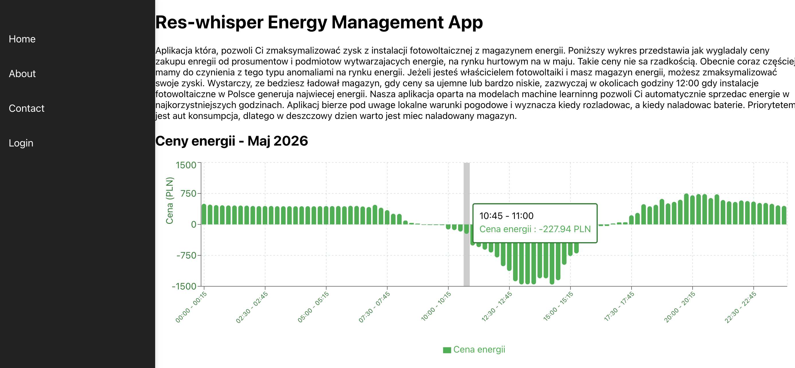
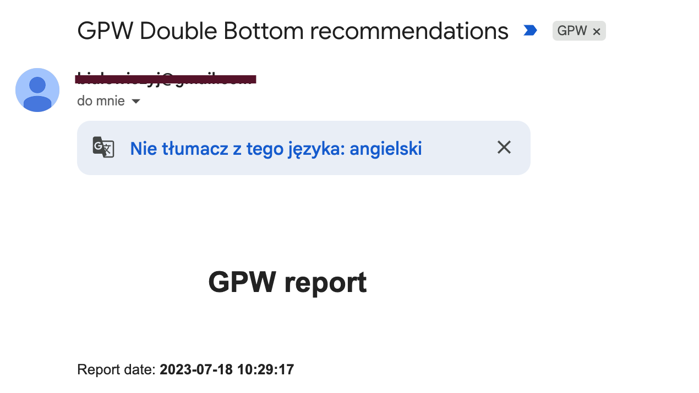
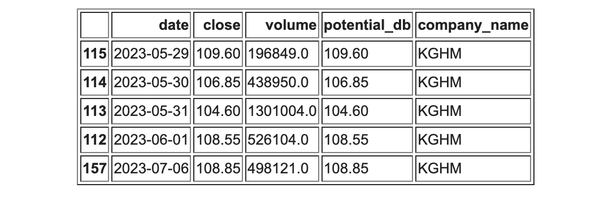

### About me
My name is Albert Majcher, I'm data engineer with 10 years of exprience. I started with SEO, and website maintenance and creation. Then i shift my carrer to data and AI. Now I'm stongly focus on Data engineering, DevOps and AI. I have few projects developed and released.

### Current Exprience
Here is my current detailed professional exprience.
- Design and implementation of Data Engineering processes (Batch and Streaming)
- Create ETL processes/pipelines using Pyspark, Databricks (Python, Scala).
- Creation and maintenance test automation framework
- Writing unit tests (pytest) and integration tests.
- Creating and implementation of CICD processes using Azure DevOps / github Actions. 
- Implementation of microservices hosted in Azure (Python)
- Virtual network and private endpoint configuration.

- Ml model deployments using mlflow library to databricks and AML.
- Model training and model performance metrics.
- Implementation of chatbot application using openai library and FastAPI, Flask.
- IaaC using bicep template and Azure DevOps pipelines.
- Lakehouse architecture on data bricks (unity catalog, delta lake, medalion architecture)

Stack: Python (pandas, numpy), Azure, Apache Spark (PySpark), Databricks, T-SQL, Rest API, Docker, CICD, Linux, Azure DevOps

### Projects
http://apps.res-whisper.com/
Application that help users that has micro energy production instalation like PV with batery storage.
To optimize investment return, by selling energy when prices are high. Prices are taken from poland energy stock, daily
and based on battery loading history and weather predict how long battery will be loading. 
To start loading when proces are lowest, and selling when are the highest.

http://res-whisper.com/
Energy blog written 100% by AI model hosted locally. Deepseek.

#### Double bottom stack watcher
Project was build to predict doubble bottom formation on GPW.
Run daily, and send report on e-mail.
